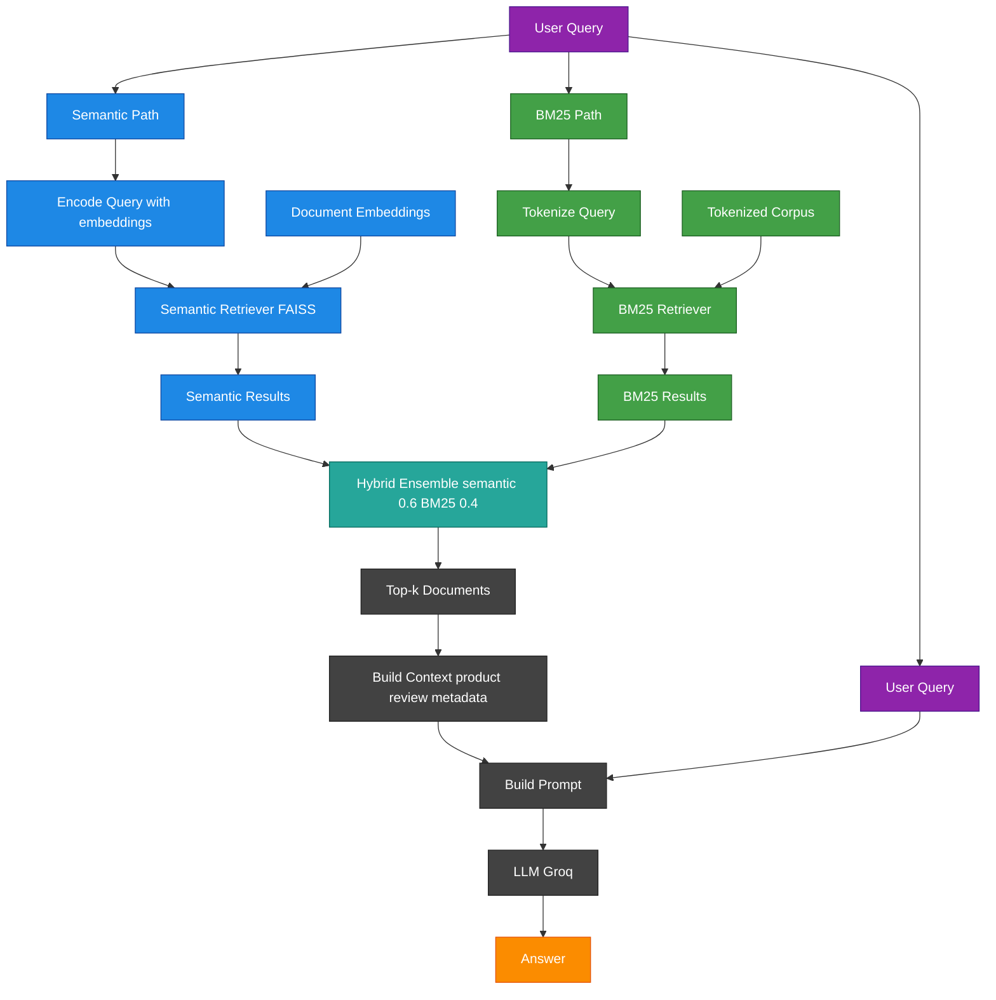

# Amazon Patio, Lawn and Garden Product Search

Team Members: Sasha S, Claire Saunders 

## Project Overview

This project builds a context-aware product search assistant that retrieves relevant Amazon products based on natural language queries. This work was developed as part of the DSCI 575: Advanced Machine Learning course.

In Milestone 1, we focus on retrieval only (no LLMs), implementing and evaluating two approaches:

- **BM25 (keyword-based retrieval)**
- **Semantic search using sentence embeddings and FAISS**

These two approaches allow us to compare traditional keyword-based retrieval with modern embedding-based methods. The system returns the most relevant products for a given query and supports a user-facing web application.

In Milestone 2, we extend this system into a full Retrieval-Augmented Generation (RAG) pipeline by integrating a large language model (LLM). This allows the system to generate natural language answers grounded in retrieved Amazon product reviews and metadata.

We also introduce a **hybrid retrieval approach**, combining BM25 and semantic search, and update the web application to support both retrieval-only and RAG-based query modes.

---

## Features 

### Milestone 1
- Semantic search using SentenceTransformers and FAISS
- BM25 keyword-based retrieval
- Query evaluation across different levels of complexity
- Structured retrieval output for integration into a web app

### Milestone 2
- Natural language answer generation using retrieved product reviews
- Hybrid retrieval supporting both keyword-based and semantic queries
- Context-aware responses grounded in Amazon product data
- Dual-mode web app:
  - Search mode (retrieval only)
  - RAG mode (generated answers + supporting results)

---

## Dataset

We use a subset of the Amazon Reviews 2023 dataset, specifically the Patio, Lawn & Garden category.

The dataset consists of two sources:

- **Reviews data**, containing user-generated content such as review text, titles, and ratings  
- **Metadata data**, containing product-level information such as product title, description, features, categories, price, and aggregate ratings  

These two sources are linked using the `parent_asin` identifier.

The dataset is sourced from:

- https://amazon-reviews-2023.github.io/  
- https://huggingface.co/datasets/McAuley-Lab/Amazon-Reviews-2023  

---

## Data Processing

The raw review and metadata files are merged using `parent_asin`.

We retain a subset of fields relevant for both retrieval and result display.

For both BM25 and semantic search, we construct a combined text field by concatenating:

- product title  
- review title  
- review text  
- features  
- description  
- categories  

In addition to this combined text used for retrieval, the following metadata fields are retained to support result display in the web application:

- `product_title`  
- `review_title`  
- `review_text`  
- `rating`  
- `average_rating`  
- `rating_number`  
- `price`  

Basic preprocessing includes:
- handling missing values (e.g., price and sparse metadata fields)  
- ensuring all text fields are consistently formatted as strings  
- converting list-based fields (features, description, categories) into plain text  
- concatenating text fields into a single document per row  

Additional preprocessing steps are applied depending on the retrieval method:

- **BM25:** tokenization (lowercasing, punctuation removal, whitespace splitting)  
- **Semantic search:** uses the combined text directly and encodes it into embeddings  

---

### Data Sampling and Size Considerations

Due to the large size of the fully merged dataset (~14GB), we use a subset of 100,000 rows for this project.

This subset was created by randomly sampling from the fully merged dataset after combining the reviews and metadata tables. While this approach does not guarantee preservation of all underlying distributions, it is expected to retain a representative mix of products, reviews, and categories without introducing systematic bias.

This design choice allows the project to:
- remain within GitHub file size limits
- be reproducible without requiring large external storage
- run locally on machines with typical RAM constraints

The processed dataset is stored as a parquet file and included in the repository to support easy setup and reproducibility. While the reduced dataset may limit full coverage of the product space, it is sufficient for evaluating retrieval performance across a range of query types.

---

# Retrieval Methods

### BM25 Retrieval

- Uses a tokenized representation of the dataset  
- Performs keyword-based retrieval using term frequency and inverse document frequency  
- Ranks documents based on how well the words in the query match the words in the document  
- Returns a BM25 relevance score for each result, where higher scores indicate better matches  

### Semantic Search

- Uses `sentence-transformers/all-MiniLM-L6-v2` to encode text into dense vector embeddings  
- FAISS is used to build an index for efficient similarity search 
- Queries are encoded and used to retrieve the most similar documents from the FAISS index
- Retrieval is based on embedding distance (closer = more similar)  

For interpretability, distances are converted into a similarity-style score:

```python
score = 1 / (1 + distance)
```
so that higher scores correspond to closer matches.

# RAG Pipeline (Milestone 2)

In Milestone 2, we extend the retrieval system into a full **Retrieval-Augmented Generation (RAG)** pipeline.

The pipeline consists of three main components:

### 1. Retriever
Given a user query, the system retrieves the top-k relevant documents.

We implement two retrieval strategies:
- **Semantic retrieval** using FAISS and sentence embeddings  
- **Hybrid retrieval** combining semantic search and BM25  

### 2. Context Builder
The retrieved documents are formatted into a structured context block that includes:
- product title  
- review title and truncated review text  
- supporting metadata (rating, average rating, number of ratings, features, and price when available)  

To manage prompt size, longer text fields are truncated before being passed to the model.

### 3. LLM Generator
A language model (via Groq API) generates a final answer using only the retrieved context.

The model is guided by a structured prompt that instructs it to:
- rely strictly on the provided context and avoid unsupported claims  
- state when the context is insufficient to answer confidently  
- provide at least 3 recommendations (up to 5 when useful)  
- mention product titles and include price when available  
- use both review text and metadata to support recommendations  
- explain why each product is a good option using evidence from the retrieved documents  
- highlight differences between products when relevant  
- avoid repeating duplicate or near-duplicate products  
- avoid generic phrasing and unsupported claims  
- do not include unnecessary statistics, reviewer names, or a concluding summary  
- keep responses concise, clear, and practical  

---

## Hybrid Retrieval

To improve retrieval performance, we implement a hybrid retriever that combines:

- **BM25 (keyword matching)** — effective for exact terms (e.g., size, color)  
- **Semantic search (embeddings)** — effective for capturing meaning and intent  

### Approach

We combine the two retrievers using a **weighted ensemble**, where:
- semantic search contributes 60%  
- BM25 contributes 40%  

This produces a single ranked list of documents that balances keyword precision with semantic understanding.

---

## RAG Variants

We implement two versions of the RAG pipeline:

- **Semantic RAG:** uses only the semantic retriever  
- **Hybrid RAG:** uses the combined hybrid retriever  

Both pipelines follow the same flow:
query → retrieve documents → build context → generate answer

The hybrid RAG pipeline is used in the final application, as it provides more robust performance across different query types.

---
## RAG Workflow Diagram



## Reproducibility and Setup

### 1. Clone the repository

```bash
git clone https://github.com/UBC-MDS/DSCI_575_project_saunde95_sashasph.git
```
If you have SSH configured, you may use the SSH URL instead of HTTPS.

### 2. Create and Activate Environment

Ensure you are in the project root, then create the environment from the yml file.

```bash
cd DSCI_575_project_saunde95_sashasph/
conda env create -f environment.yml
conda activate retrieval-app
```

### 3. Build Retrieval Artifacts (Required Before Running the App)

Both retrieval methods require a one-time local build step.

Build BM25 Retriever:
```bash
python -m src.build_bm25
```

This will: 
- create tokenized documents
- build the BM25 retriever
- save them to `data/processed/` as `.pkl` files

Build Semantic Index:

```bash
python -m src.build_semantic_index
```

This will: 
- load the processed parquet dataset
- construct a combined text field for each row
- convert rows into LangChain Document objects
- generate embeddings using `sentence-transformers/all-MiniLM-L6-v2`
- build a FAISS vector store using LangChain
- save the vector store locally to `data/processed/faiss_store/`

If the vector store already exists, it will be loaded instead of rebuilt.

These steps only need to be run once. If the saved files already exist, they will be reused.

### 4. Set Up API Key (Required for RAG Mode)

This project uses the Groq API to access the language model for RAG-based responses.

#### Step 1: Create a Groq API Key
- Go to: https://console.groq.com/keys
- Sign in and select  `Create API Key`
- Copy and save your key securely

#### Step 2: Create a `.env` file
In the root of the project, create a file named .env and add:
```bash
GROQ_API_KEY=your_api_key_here
```

You can create and edit the file using:

```bash
touch .env
nano .env
```

### 5. Run the app locally

```bash
shiny run app/app.py
```
Then open the provided local URL in your browser. 

⚠️ A valid Groq API key is required to run the app, as the application initializes the language model on startup.

The app supports:

- Search mode: displays retrieved products using BM25 and semantic search
- RAG mode: generates a natural language answer using the full RAG pipeline
---

## Evaluation

### Milestone 1

We created a set of 10 queries with varying levels of complexity:
- keyword-based queries  
- semantic (natural language) queries  
- complex multi-constraint queries  

Both BM25 and semantic retrieval methods were evaluated by retrieving the top 5 results for each query.

A subset of 5 queries was selected for detailed comparison. 

Results and discussion can be found in:
- `results/milestone1_discussion.md`
- `notebooks/milestone1_evaluation.ipynb`

---

### Milestone 2

We evaluated the **Hybrid RAG pipeline** using the same set of 10 queries from Milestone 1.

Evaluation was performed qualitatively on the generated answers across three dimensions:
- **Accuracy** — whether the answer is supported by the retrieved reviews and metadata  
- **Completeness** — whether the answer addresses all aspects of the query  
- **Fluency** — whether the answer is clear, coherent, and natural  

A subset of 5 queries was selected for detailed analysis.

Results and discussion can be found in:
- `results/milestone2_discussion.md`
- `notebooks/milestone2_rag.ipynb`

## Key Observations

- The hybrid RAG pipeline performs well on keyword-based and moderately abstract queries, combining precise matching (BM25) with semantic understanding.  
- Performance declines on complex multi-constraint queries, where relevant documents are not consistently retrieved.  
- In these cases, the LLM often filters out weak results rather than returning incorrect recommendations, resulting in fewer but more reasonable outputs.  

---

## Notes

- Retrieval artifacts for both BM25 (tokenized documents and retriever object) and semantic search (LangChain FAISS vector store) are generated locally and stored in `data/processed/`. These files are not included in the repository due to size constraints.  
- Duplicate results may occur because each review is treated as a separate document rather than aggregating at the product level.  
- The RAG pipeline is sensitive to context size, combining results from multiple retrieval methods can lead to longer prompts, requiring truncation of text fields or limiting the number of retrieved documents.
- Future improvements could include a re-ranking step to better prioritize the most relevant documents before generation.