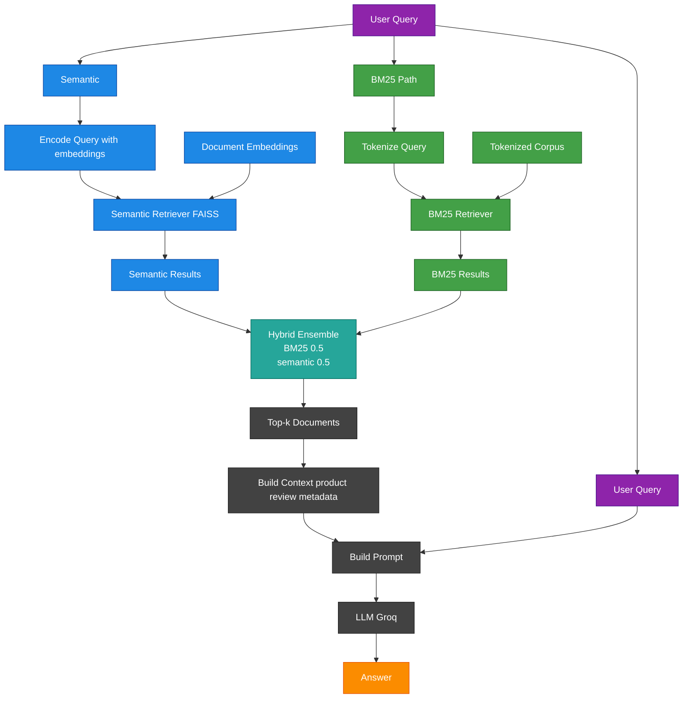

# Amazon Patio, Lawn and Garden Product Search

Team Members: Sasha S, Claire Saunders

## Project Overview

This project builds a context-aware product search assistant that retrieves relevant Amazon products based on natural language queries. This work was developed as part of the DSCI 575: Advanced Machine Learning course.

In Milestone 1, we focus on retrieval only (no LLMs), implementing and evaluating two approaches:

- **BM25 (keyword-based retrieval)**
- **Semantic search using sentence embeddings and FAISS**

These two approaches allow us to compare traditional keyword-based retrieval with modern embedding-based methods. The system returns the most relevant products for a given query and supports a user-facing web application.

In Milestone 2, we extend this system into a full Retrieval-Augmented Generation (RAG) pipeline by integrating a large language model (LLM). This allows the system to generate natural language answers grounded in retrieved Amazon product reviews and metadata.

We also introduce a **hybrid retrieval approach**, combining BM25 and semantic search, and update the web application to support both retrieval-only and RAG-based query modes, with options for semantic and hybrid retrieval.

In Milestone 3, we scale our dataset to 100,647 product-level documents (one per product) by re-building our parquet file to be aggregated at the product level. Further, we implement a new and improved LLM model with greater reasoning skills and update our code base to improve overall quality. All changes to code quality and more descriptions of what has changed since Milestone 2 can be found in `results/final_discussion.md`. 

---

## Features 

### Milestone 1
- Semantic search using SentenceTransformers and FAISS
- BM25 keyword-based retrieval
- Query evaluation across different levels of complexity
- Structured retrieval output for integration into a web app

### Milestone 2
- Natural language answer generation using retrieved product reviews
- Hybrid retrieval supporting both keyword-based and semantic queries
- Context-aware responses grounded in Amazon product data
- Dual-mode web app:
  - Search mode (retrieval only)
  - RAG mode (generated answers + supporting results)

### Milestone 3
- Stronger LLM model with improved reasoning ability
- Scaled dataset to 100,647 product-level documents (one per unique product) with multiple reviews for richer product-level context and improved retrieval quality. 

---

## Dataset

We use a subset of the Amazon Reviews 2023 dataset, specifically the Patio, Lawn & Garden category.

The dataset consists of two sources:

- **Reviews data**, containing user-generated content such as review text, titles, and ratings  
- **Metadata data**, containing product-level information such as product title, description, features, categories, price, and aggregate ratings  

These two sources are linked using the `parent_asin` identifier.

The dataset is sourced from:

- https://amazon-reviews-2023.github.io/  
- https://huggingface.co/datasets/McAuley-Lab/Amazon-Reviews-2023  

---

## Data Processing

The raw review and metadata files are merged using `parent_asin`. We then sample from the merged review-level dataset and aggregate to one row per product using `parent_asin`. During this step, all review texts associated with a product are concatenated into a single review_text field, while review_title and product-level metadata fields are retained using the first observed value for each product. This reduces duplicate results during retrieval and allows each document to contain richer product-level information.

We retain a subset of fields relevant for both retrieval and result display.

For both BM25 and semantic search, we construct a combined text field by concatenating:

- `product_title`
- `review_title` (first review after aggregation)  
- `review_text` (aggregated) 
- `features` 
- `description`  
- `categories`  

Review-level fields such as individual ratings are removed prior to aggregation to avoid conflicts across multiple reviews for the same product.

In addition to this combined text used for retrieval, the following metadata fields are retained to support result display in the web application:

- `product_title`  
- `review_title`  
- `review_text`  
- `average_rating`  
- `rating_number`  
- `price`  

Basic preprocessing includes:
- handling missing values (e.g., price and sparse metadata fields)  
- ensuring all text fields are consistently formatted as strings  
- converting list-based fields (features, description, categories) into plain text  
- concatenating text fields into a single document per row  

Additional preprocessing steps are applied depending on the retrieval method:

- **BM25:** tokenization (lowercasing, punctuation removal, whitespace splitting)  
- **Semantic search:** uses the combined text directly and encodes it into embeddings  

---

### Data Sampling and Size Considerations

Due to the large size of the fully merged dataset (~14GB), we construct a scaled dataset of 100,647 product-level rows.

This dataset is created by sampling from the merged review-level dataset and then aggregating to the product level. While this approach does not guarantee preservation of all underlying distributions, it is expected to retain a representative mix of products, reviews, and categories without introducing systematic bias.

This design choice allows the project to:
- remain within GitHub file size limits
- be reproducible without requiring large external storage
- run locally on machines with typical RAM constraints

The processed dataset is stored as a parquet file and included in the repository to support easy setup and reproducibility. While the reduced dataset may limit full coverage of the product space, it is sufficient for evaluating retrieval performance across a range of query types.

---

## Retrieval Methods

### BM25 Retrieval

- Uses a tokenized representation of the dataset  
- Performs keyword-based retrieval using term frequency and inverse document frequency  
- Ranks documents based on how well the words in the query match the words in the document  
- Returns a ranked list of relevant documents based on keyword matching

### Semantic Search

- Uses `sentence-transformers/all-MiniLM-L6-v2` to encode text into dense vector embeddings  
- FAISS is used to build an index for efficient similarity search
- Queries are encoded and used to retrieve the top-k most similar documents from the FAISS index
- Retrieval is based on cosine similarity between normalized embeddings, where higher scores indicate more similar documents.

Both retrieval methods operate on product-level documents, where each document represents a single product with aggregated review content.

## RAG Pipeline (Milestone 2)

In Milestone 2, we extended the retrieval system into a full **Retrieval-Augmented Generation (RAG)** pipeline.

The pipeline consists of three main components:

### 1. Retriever
Given a user query, the system retrieves the top-k relevant documents.

We implement two retrieval strategies:
- **Semantic retrieval** using FAISS and sentence embeddings  
- **Hybrid retrieval** combining semantic search and BM25  

### 2. Context Builder
The retrieved documents are formatted into a structured context block that includes:
- product title  
- review title and truncated review text  
- supporting metadata (average rating, number of ratings, features, and price when available)  

To manage prompt size, longer text fields are truncated before being passed to the model.

### 3. LLM Generator
A language model (via Groq API) generates a final answer using only the retrieved context.

#### Model Selection

We compared two LLMs with different sizes and capabilities during development:

- **`llama-3.1-8b-instant`** — a smaller, faster model with strong instruction-following but more limited reasoning ability  
- **`llama-3.3-70b-versatile`** — a larger model with stronger reasoning and improved ability to synthesize information across multiple retrieved documents  

Through qualitative evaluation (see `notebooks/milestone3_exploration.ipynb`), we found that the 70B model consistently produced higher-quality outputs, particularly for more complex or abstract queries. It demonstrated stronger reasoning, better handling of incomplete context, and more natural explanations.

Based on these results, we selected **`llama-3.3-70b-versatile`** as the default model for our final RAG pipeline.

#### Prompt Development

We iteratively refined the system prompt to improve response quality, structure, and relevance in an application setting. Early versions of the prompt enforced strict constraints (e.g., always returning at least three recommendations), but this often led to weaker or less relevant results when the retrieved context was limited.

The final prompt was optimized to:
- prioritize relevance over forcing a fixed number of recommendations  
- encourage concise, practical responses grounded in retrieved context  
- use review text and metadata to support recommendations  
- avoid unsupported claims and unnecessary statistics  
- improve readability by encouraging clearer separation between product recommendations  

These refinements resulted in more consistent, informative, and user-friendly outputs.

The final prompt used in the application is shown below:

```python
SYSTEM_PROMPT_FINAL = """
You are a helpful Amazon shopping assistant for Patio, Lawn and Garden products.

Answer the user's question using ONLY the provided Amazon product review and metadata context.
Do NOT make up products or details that are not supported by the context.
If the context is not sufficient, clearly say so.

FORMAT YOUR RESPONSE EXACTLY AS FOLLOWS:

- Provide up to 5 product recommendations when relevant.
- prioritize products that best match the user’s request
- use review insights to support explanations when helpful (e.g., durability, ease of use, common issues)
- avoid generic or repetitive statements about ratings (e.g., "highly rated", "4.5 stars") unless they add meaningful context
- do not include products that clearly do not match key constraints in the query (e.g., wrong color, size, or use)
- only include products that are supported by the context and are meaningfully relevant; do not include filler items to reach a specific number
- Use a clean numbered list (1., 2., 3., etc.) with no extra text between items
- Each item must follow this structure:

<Number>. **Product Title** (Price if available)
1–2 sentences of why this product fits the user’s request.

Optionally include a short one-line header before the list that directly reflects the user’s request.
Do NOT include long introductions or explanations before the list.
Do NOT include a concluding summary sentence.

STYLE GUIDELINES:
- Keep the tone professional and friendly
- Be concise and practical
- Avoid generic phrases (e.g., “great gift”) without specific reasoning
- Highlight what makes each option distinct when relevant
- Avoid duplicate or irrelevant products
"""
```
---

## Hybrid Retrieval

To improve retrieval performance, we implement a hybrid retriever that combines:

- **BM25 (keyword matching)** — effective for exact terms (e.g., size, color)  
- **Semantic search (embeddings)** — effective for capturing meaning and intent  

### Approach

We combine the two retrievers using a **weighted ensemble**, where:
- semantic search contributes 50%  
- BM25 contributes 50%  

This produces a single ranked list of documents that balances keyword precision with semantic understanding.

---

## RAG Variants

We implement two versions of the RAG pipeline:

- **Semantic RAG:** uses only the semantic retriever  
- **Hybrid RAG:** uses the combined hybrid retriever  

Both pipelines follow the same flow:
query → retrieve documents → build context → generate answer

Both semantic and hybrid RAG pipelines are available in the web application, allowing users to compare their behavior directly.

Both semantic and hybrid RAG pipelines are also demonstrated in `notebooks/milestone2_rag.ipynb`, where they can be run interactively to inspect intermediate outputs and generated responses.

---
## RAG Workflow Diagram

The diagram below shows the retrieval and generation workflow used in the app when RAG mode with the hybrid method is selected. In Semantic RAG, only the semantic branch is used. In Hybrid RAG, both the semantic and BM25 branches are combined before generation.




## Reproducibility and Setup

### 1. Clone the repository

```bash
git clone https://github.com/UBC-MDS/DSCI_575_project_saunde95_sashasph.git
```
If you have SSH configured, you may use the SSH URL instead of HTTPS.

### 2. Create and Activate Environment

Ensure you are in the project root, then create the environment from the yml file.

```bash
cd DSCI_575_project_saunde95_sashasph/
conda env create -f environment.yml
conda activate retrieval-app
```

### 3. Build Retrieval Artifacts (Required Before Running the App)

Both retrieval methods require a one-time local build step.

Build BM25 Retriever:
```bash
python -m src.build_bm25
```

This will: 
- check whether a saved BM25 corpus and metadata already exist
- if they exist, reuse them
- otherwise, tokenize the dataset and build a BM25 corpus
- save the tokenized corpus and metadata to `data/processed/bm25_store/` for reuse

Build Semantic Index:

```bash
python -m src.build_semantic_index
```

This will:
- check whether a saved FAISS vector store already exists
- if it exists, load it from disk
- otherwise, load the processed dataset and construct a combined text field for each row
- generate embeddings using `sentence-transformers/all-MiniLM-L6-v2`
- build a FAISS vector store using cosine similarity
- save the vector store to `data/processed/faiss_store/` for reuse

These steps only need to be run once. If the saved files already exist, they will be reused.

### 4. Set Up API Key (Required to Run the App)

This project uses the Groq API to access the language model for RAG-based responses. Because the app initializes the LLM on startup, a valid API key is required to run the application.

#### Step 1: Create a Groq API Key
- Go to: https://console.groq.com/keys
- Sign in and select  `Create API Key`
- Copy and save your key securely

#### Step 2: Create a `.env` file
In the root of the project, create a file named .env and add:
```bash
GROQ_API_KEY=your_api_key_here
```

You can create and edit the file using:

```bash
touch .env
nano .env
```

### 5. Run the app locally

```bash
shiny run app/app.py
```
Then open the provided local URL in your browser. 

⚠️ A valid Groq API key is required to run the app, as the application initializes the language model on startup.

The app supports:

- Search mode: displays retrieved products using BM25, semantic search, and hybrid retrieval
- RAG mode: generates a natural language answer using either the semantic or hybrid RAG pipeline

In RAG mode, users can choose between semantic or hybrid retrieval to generate responses, while Search mode allows comparison of BM25, semantic, and hybrid retrieval without generation.

---

## Evaluation

### Milestone 1

We created a set of 10 queries with varying levels of complexity:
- keyword-based queries  
- semantic (natural language) queries  
- complex multi-constraint queries  

Both BM25 and semantic retrieval methods were evaluated by retrieving the top 5 results for each query.

A subset of 5 queries was selected for detailed comparison. 

Results and discussion can be found in:
- `results/milestone1_discussion.md`
- `notebooks/milestone1_evaluation.ipynb`

---

### Milestone 2

We evaluated the **Hybrid RAG pipeline** using the same set of 10 queries from Milestone 1.

Evaluation was performed qualitatively on the generated answers across three dimensions:
- **Accuracy** — whether the answer is supported by the retrieved reviews and metadata  
- **Completeness** — whether the answer addresses all aspects of the query  
- **Fluency** — whether the answer is clear, coherent, and natural  

A subset of 5 queries was selected for detailed analysis.

Results and discussion can be found in:
- `results/milestone2_discussion.md`
- `notebooks/milestone2_rag.ipynb`


**Key Observations**

- The hybrid RAG pipeline performs well on keyword-based and moderately abstract queries, combining precise matching (BM25) with semantic understanding.  
- Performance declines on complex multi-constraint queries, where relevant documents are not consistently retrieved.  
- In these cases, the LLM often filters out weak results rather than returning incorrect recommendations, resulting in fewer but more reasonable outputs.  

### Milestone 3

In Milestone 3, we evaluated improvements to the RAG pipeline by comparing different LLMs and refining the system prompt.

We compared two models (`llama-3.1-8b-instant` and `llama-3.3-70b-versatile`) using the same set of queries and retrieved context. Evaluation was qualitative and focused on:

- **Relevance** — whether recommended products closely match the user’s request  
- **Reasoning** — how well the model synthesizes information across multiple documents  
- **Clarity** — how easy the responses are to read and interpret  

We also iteratively refined the system prompt to improve output structure, reduce irrelevant recommendations, and better prioritize strong matches when context is limited.

Results and discussion can be found in:
- `results/final_discussion.md`
- `notebooks/milestone3_exploration.ipynb`

---

## Notes

- Retrieval artifacts for both BM25 (tokenized corpus and metadata) and semantic search (FAISS vector store) are generated locally and stored in `data/processed/`. These files are not included in the repository due to size constraints and are rebuilt or loaded as needed.

- The RAG pipeline is sensitive to context size. Combining results from multiple retrieval methods can lead to longer prompts, requiring truncation of text fields to remain within model token limits.

- In RAG mode, the products referenced in the AI-generated response may not always perfectly align with the products displayed below. The app attempts to surface the most relevant retrieved documents, but the mapping between generated content and displayed results is not guaranteed to be exact.

- When the retrieved context does not provide sufficient information, the model may return fewer recommendations or indicate uncertainty rather than forcing unsupported outputs.

- Running RAG queries too frequently or in rapid succession may result in failures due to API rate limits.

- Future improvements could include adding a re-ranking step to better prioritize the most relevant documents before generation, as well as deploying the application to a cloud environment for scalability.